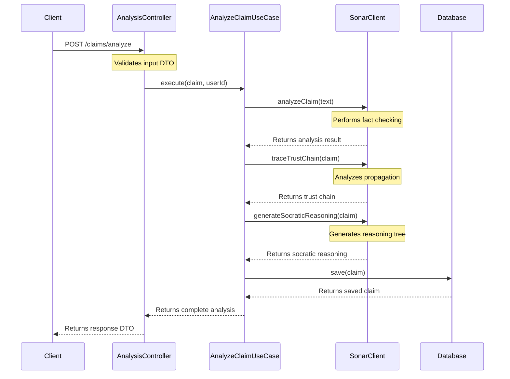
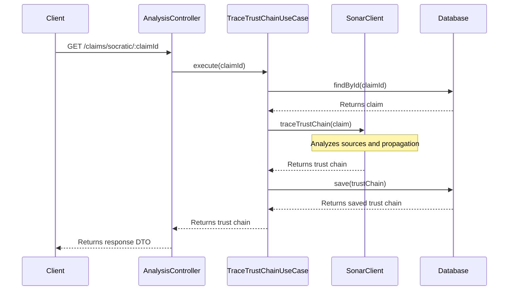
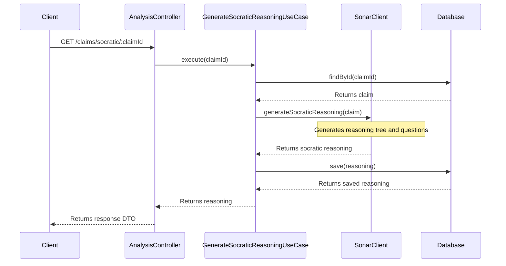

# TruthTracer Sequence Diagrams

## Claim Analysis Flow

```mermaid
sequenceDiagram
    participant Client
    participant Controller as AnalysisController
    participant UseCase as AnalyzeClaimUseCase
    participant Sonar as SonarClient
    participant DB as Database

    Client->>Controller: POST /claims/analyze
    Note over Controller: Validates input DTO
    Controller->>UseCase: execute(claim, userId)
    
    UseCase->>Sonar: analyzeClaim(text)
    Note over Sonar: Performs fact checking
    Sonar-->>UseCase: Returns analysis result
    
    UseCase->>Sonar: traceTrustChain(claim)
    Note over Sonar: Analyzes propagation
    Sonar-->>UseCase: Returns trust chain
    
    UseCase->>Sonar: generateSocraticReasoning(claim)
    Note over Sonar: Generates reasoning tree
    Sonar-->>UseCase: Returns socratic reasoning
    
    UseCase->>DB: save(claim)
    DB-->>UseCase: Returns saved claim
    
    UseCase-->>Controller: Returns complete analysis
    Controller-->>Client: Returns response DTO
```

## Trust Chain Analysis

```mermaid
sequenceDiagram
    participant Client
    participant Controller as AnalysisController
    participant UseCase as TraceTrustChainUseCase
    participant Sonar as SonarClient
    participant DB as Database

    Client->>Controller: GET /claims/socratic/:claimId
    Controller->>UseCase: execute(claimId)
    
    UseCase->>DB: findById(claimId)
    DB-->>UseCase: Returns claim
    
    UseCase->>Sonar: traceTrustChain(claim)
    Note over Sonar: Analyzes sources and propagation
    Sonar-->>UseCase: Returns trust chain
    
    UseCase->>DB: save(trustChain)
    DB-->>UseCase: Returns saved trust chain
    
    UseCase-->>Controller: Returns trust chain
    Controller-->>Client: Returns response DTO
```

## Socratic Reasoning Generation

```mermaid
sequenceDiagram
    participant Client
    participant Controller as AnalysisController
    participant UseCase as GenerateSocraticReasoningUseCase
    participant Sonar as SonarClient
    participant DB as Database

    Client->>Controller: GET /claims/socratic/:claimId
    Controller->>UseCase: execute(claimId)
    
    UseCase->>DB: findById(claimId)
    DB-->>UseCase: Returns claim
    
    UseCase->>Sonar: generateSocraticReasoning(claim)
    Note over Sonar: Generates reasoning tree and questions
    Sonar-->>UseCase: Returns socratic reasoning
    
    UseCase->>DB: save(reasoning)
    DB-->>UseCase: Returns saved reasoning
    
    UseCase-->>Controller: Returns reasoning
    Controller-->>Client: Returns response DTO
``` 