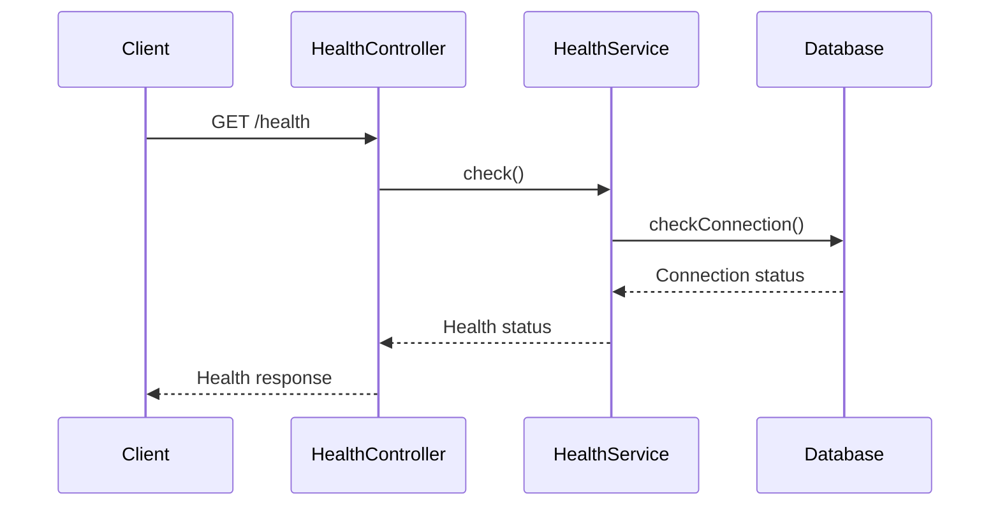
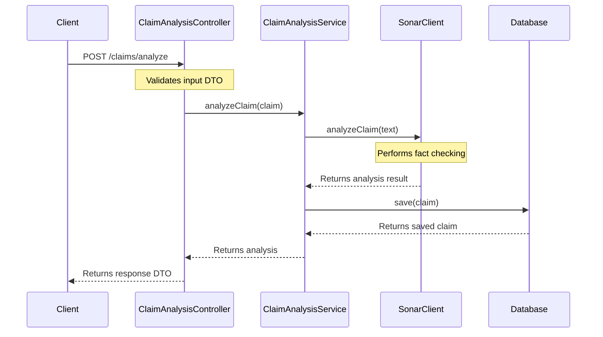
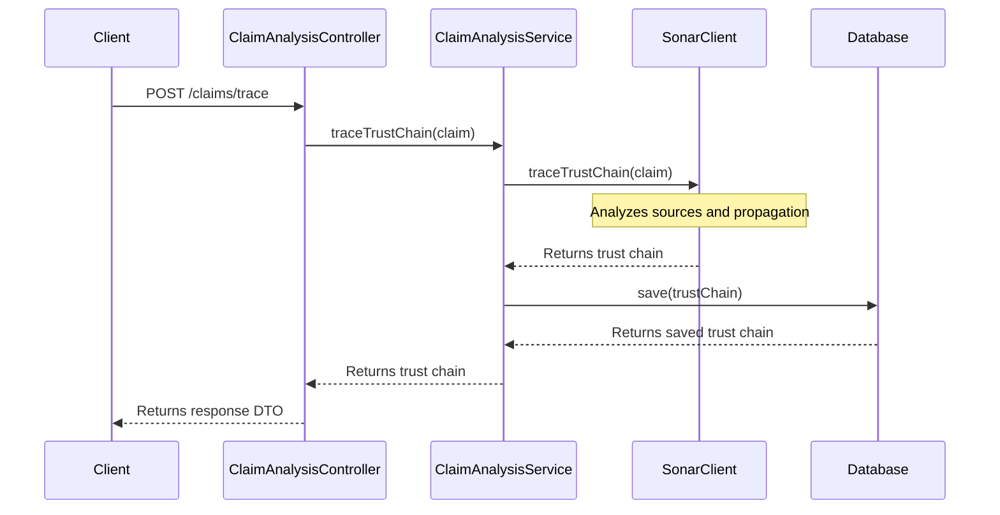
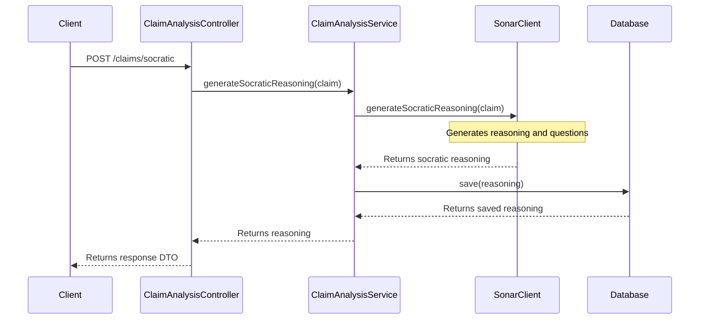

# TruthTracer Sequence Diagrams

## Health Check Flow

```mermaid
sequenceDiagram
    participant Client
    participant Controller as HealthController
    participant Service as HealthService
    participant DB as Database

    Client->>Controller: GET /health
    Controller->>Service: check()
    
    Service->>DB: checkConnection()
    DB-->>Service: Connection status
    
    Service-->>Controller: Health status
    Controller-->>Client: Health response
```

## Claim Analysis Flow

```mermaid
sequenceDiagram
    participant Client
    participant Controller as ClaimAnalysisController
    participant Service as ClaimAnalysisService
    participant Sonar as SonarClient
    participant DB as Database

    Client->>Controller: POST /claims/analyze
    Note over Controller: Validates input DTO
    Controller->>Service: analyzeClaim(claim)
    
    Service->>Sonar: analyzeClaim(text)
    Note over Sonar: Performs fact checking
    Sonar-->>Service: Returns analysis result
    
    Service->>DB: save(claim)
    DB-->>Service: Returns saved claim
    
    Service-->>Controller: Returns analysis
    Controller-->>Client: Returns response DTO
```

## Trust Chain Analysis

```mermaid
sequenceDiagram
    participant Client
    participant Controller as ClaimAnalysisController
    participant Service as ClaimAnalysisService
    participant Sonar as SonarClient
    participant DB as Database

    Client->>Controller: POST /claims/trace
    Controller->>Service: traceTrustChain(claim)
    
    Service->>Sonar: traceTrustChain(claim)
    Note over Sonar: Analyzes sources and propagation
    Sonar-->>Service: Returns trust chain
    
    Service->>DB: save(trustChain)
    DB-->>Service: Returns saved trust chain
    
    Service-->>Controller: Returns trust chain
    Controller-->>Client: Returns response DTO
```

## Socratic Reasoning Generation

```mermaid
sequenceDiagram
    participant Client
    participant Controller as ClaimAnalysisController
    participant Service as ClaimAnalysisService
    participant Sonar as SonarClient
    participant DB as Database

    Client->>Controller: POST /claims/socratic
    Controller->>Service: generateSocraticReasoning(claim)
    
    Service->>Sonar: generateSocraticReasoning(claim)
    Note over Sonar: Generates reasoning and questions
    Sonar-->>Service: Returns socratic reasoning
    
    Service->>DB: save(reasoning)
    DB-->>Service: Returns saved reasoning
    
    Service-->>Controller: Returns reasoning
    Controller-->>Client: Returns response DTO
``` 